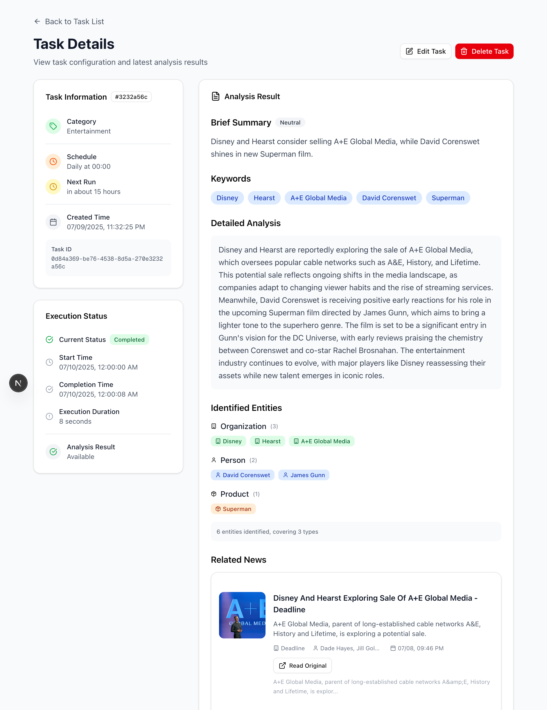

# News Analysis

本项目实现了一个集自动新闻抓取、人工智能分析和实时用户通知于一体的新闻分析平台，支持自动化新闻获取、AI 分析和实时通知推送。系统主要用于定期分析特定主题的新闻内容，并通过多种方式向用户推送分析结果。

## Features

创建定时分析任务，根据关键词/分类总结近期要闻，生成包含实体、情感分析的报告，支持管理、修改任务




> [!NOTE] 
> 
> 飞书文档上有完整的演示视频和图片
> [点击前往](https://apd8i6ao7j.feishu.cn/docx/YojrdJbiuo3TtYxYNl4coveznBd)

## 架构介绍

项目采用 **pnpm workspace + turborepo** 的 Monorepo 架构：

```
news-ana/
├── apps/
│   ├── backend/          # NestJS 后端服务
│   └── frontend/         # Next.js 前端应用
├── packages/
│   └── schema/           # 共享类型定义和验证规则
├── pnpm-workspace.yaml   # pnpm 工作空间配置
└── turbo.json           # Turbo 构建配置
```

后端 (@na/backend) 基于以下技术栈实现：

- **框架**: NestJS 11.x (基于 Express)
- **数据库**: PostgreSQL + Prisma ORM
- **任务队列**: BullMQ + Redis
- **身份认证**: Passport + JWT
- **AI 集成**: OpenAI SDK + AI SDK
- **实时通知**: Web Push + SSE (Server-Sent Events)

前端 (@na/frontend) 基于以下技术栈实现：

- **框架**: Next.js 15.x (App Router)
- **UI 组件**: Radix UI + shadcn/ui
- **AI 集成**: Vercel AI SDK + AI SDK + OpenAI API
- **样式**: Tailwind CSS 4.x
- **状态管理**: Jotai (原子化状态管理)
- **表单处理**: Valibot + Server Action，服务端校验
- **实时更新**: SSE + Web Push API

共享 Schema 包 (@na/schema)基于 Valibot 的运行时类型验证，定义了前后端共享相同的类型定义和验证规则

由于时间有限，我重点介绍要求相关的 AI 分析、队列、实时推送的部分，我没有介绍更详细的介绍其他部分，可以参考 [https://deepwiki.com/aidenlxxf/news-ana/](https://deepwiki.com/aidenlxxf/news-ana/) 查看 AI 生成的项目文档了解整体架构，包括[数据库设计](https://deepwiki.com/aidenlxxf/news-ana/6.1-database-schema)等

### AI 分析

基于 [Vercel AI SDK](https://ai-sdk.dev/docs/introduction) + [Valibot Schema](https://ai-sdk.dev/docs/reference/ai-sdk-core/valibot-schema#valibotschema) 实现结构 JSON 输出，目前使用 gpt4o-mini 模型总结，使用以下 Prompt

```
You are a professional news analyst. Your task is to analyze a collection of news articles and provide a structured analysis in JSON format.

Based on the provided articles, you must provide:
1. A brief summary: A single sentence summarizing the main points, suitable for push notifications (100-150 characters).
2. A detailed summary: A comprehensive analysis including background information, main viewpoints, trend analysis, and impact assessment.
3. An overall sentiment analysis: 'positive', 'negative', or 'neutral'.
4. Key entity extraction: Including PERSON, ORGANIZATION, LOCATION, PRODUCT, EVENT.

Ensure your analysis is objective and based strictly on the content of the provided articles.
```

结构输出大致如下（详见 [news-ai-analysis.schema.ts](https://github.com/aidenlxxf/news-ana/blob/main/packages/schema/src/news-analysis/news-ai-analysis.schema.ts) ）

```typescript
interface Output {
    briefSummary: {
        text: string;
        keywords: string[];
        sentiment: "positive" | "negative" | "neutral";
    };
    detailedSummary: string;
    sentiment: "positive" | "negative" | "neutral";
    entities: {
        name: string;
        type: "PERSON" | "ORGANIZATION" | "LOCATION" | "PRODUCT" | "EVENT";
    }[]
}
```

具体分析逻辑可以在 [news-analysis.service.ts](https://github.com/aidenlxxf/news-ana/tree/main/apps/backend/src/news-analysis/news-analysis.service.ts) 中查看

### 实时通知推送

我实现了两套实时推送机制，如果在 https 环境下且浏览器支持，默认使用基于 **Web Push API** 和 Service Worker 的方案，备用方案使用 **Server-Sent Events (SSE) **进行更新通知

基于 Web Push 的方案会自动检测是否有网页在前台，以及推送的消息类型，选择是触发网页更新，还是推送系统通知提醒用户

基本通知流程大致如下

```
任务执行 → BullMQ Worker → 数据库更新 → 通知服务 → Web Push/SSE → 前端更新/推送系统通知
```

### 任务队列和定时任务

基于 BullMQ + Redis，我设计了三个队列：`task-scheduler` -> `news-fetch` -> `news-analysis`

其中 `task-scheduler` 包括一个 Job Scheduler，会根据任务设定的要求定期发起 news-fetch 任务，news-fetch 在成功获取到新闻后会触发 `news-analysis` ，所有任务都在单独的 worker 中异步进行，且会推送更新进度到客户端

目前支持两种定期执行模式：每天指定时间分析或每小时分析，均正确支持了用户时区

另外，我还基于 Bull Board 提供 Web UI 监控队列状态，仅需访问后端的 `/queue/ui` 即可查看定期任务执行情况

#### 任务生命周期管理

1. **任务创建**: 用户创建任务 → 立即执行一次 → 设置定时调度
2. **执行监控**: 实时状态更新 (PENDING → FETCHING → ANALYZING → COMPLETED)
3. **错误处理**: 指数退避重试机制，最多 3 次重试
4. **结果存储**: 执行结果存储在 TaskExecution 表中

## 如何部署

该项目使用 Redis 8、Postgres 17、nestjs 11、nextjs 15.3

1. 请确保 Redis 和 Postgres 已经安装，你可以使用 docker 部署：

```bash
docker run -d \
  --name redis8 \
  -p 6379:6379 \
  -v redis_data:/data \
  redis:8-alpine \
  redis-server --appendonly yes

docker run -d \
  --name postgres17 \
  -p 5432:5432 \
  -e POSTGRES_PASSWORD=your_password \
  -e POSTGRES_DB=your_database \
  -v postgres_data:/var/lib/postgresql/data \
  postgres:17-alpine
```

1. 本项目使用 node 24，请确保在环境中安装好对应版本的 node，然后安装并构建前后端

```bash
corepack enable pnpm
pnpm install --frozen-lockfile
pnpm run turbo build
```

2. 配置好以下的环境变量 [News Analysis](https://apd8i6ao7j.feishu.cn/docx/YojrdJbiuo3TtYxYNl4coveznBd#share-QJQvdK3UvoiZ5pxMHJkc1oLznNb)

   - 需要前往 [https://newsapi.org/](https://newsapi.org/) 和 [https://platform.openai.com/](https://platform.openai.com/) 获取需要的 API Key
3. 运行前后端

```bash
# 启动后端
pnpm --filter @mx/backend start
# 启动前端
pnpm --filter @mx/frontend start
```

4. 如果需要 Web Push 支持，你需要启用 https，可根据需要使用 nginx 或 caddy 反向代理 http://localhost:3000 ，caddy 可基于以下配置，根据官方教程配置好 Let's Encrypt 和自己的域名来支持 https

```bash
your-domain.com {
    reverse_proxy localhost:3000
}
```

5. (可选) 如果需要添加测试账户 (test:password)，请运行

```bash
pnpm --filter @na/backend run db:seed
```

### 环境变量

在 `apps/backend/.env` 中添加以下环境变量

#### External Service Configuration

The backend requires several API keys and service endpoints:

| Variable        | Purpose                        | Usage                                                                 |
| --------------- | ------------------------------ | --------------------------------------------------------------------- |
| NEWSAPI_API_KEY | NewsAPI service authentication | News fetching operations [https://newsapi.org/](https://newsapi.org/) |
| OPENAI_API_KEY  | OpenAI API authentication      | AI-powered news analysis                                              |
| DATABASE_URL    | PostgreSQL connection string   | Prisma database operations                                            |
| REDIS_URL       | Redis connection string        | BullMQ queue management                                               |

#### Web Push Notification Configuration

VAPID (Voluntary Application Server Identification) configuration enables web push notifications:

@na/backend 提供生成脚本，请运行以下命令获取 VAPID_PRIVATE_KEY 和 VAPID_PUBLIC_KEY

```bash
pnpm --filter @na/backend run webpush:gen-vapid
```

| Variable          | Purpose                              |                                                                                                                       |
| ----------------- | ------------------------------------ | --------------------------------------------------------------------------------------------------------------------- |
| VAPID_PRIVATE_KEY | Private key for VAPID authentication |                                                                                                                       |
| VAPID_PUBLIC_KEY  | Public key for client registration   |                                                                                                                       |
| VAPID_SUBJECT     | Contact information for push service | [mailto:example@mail.com](mailto:example@mail.com) / [https://example.com/contact-me](https://example.com/contact-me) |

#### Authentication Configuration

JWT-based authentication system configuration:

使用以下命令生成 JWT_SECERT

```bash
openssl rand -base64 32
```

| Variable         | Purpose                       | Default Behavior                |
| ---------------- | ----------------------------- | ------------------------------- |
| JWT_SECRET       | Token signing secret          | Falls back to "fallback-secret" |
| JWT_EXPIRES_IN   | Token expiration time         | Configurable (e.g., '1d', '7d') |
| AUTH_COOKIE_NAME | Cookie name for token storage | Falls back to "auth_token"      |

#### Frontend Configuration

在 `apps/frontend/.env` 中添加以下环境变量

| Variable                     | Purpose                      | Usage Context                                                            |
| ---------------------------- | ---------------------------- | ------------------------------------------------------------------------ |
| BACKEND_HOST                 | Backend API endpoint         | Server-side API calls，默认为 [http://localhost:3600](http://localhost:3600) |
| AUTH_COOKIE_NAME             | Authentication cookie name   | Must match backend configuration                                         |
| NEXT_PUBLIC_VAPID_PUBLIC_KEY | VAPID public key for browser | Client-side, public, must match backend config                           |